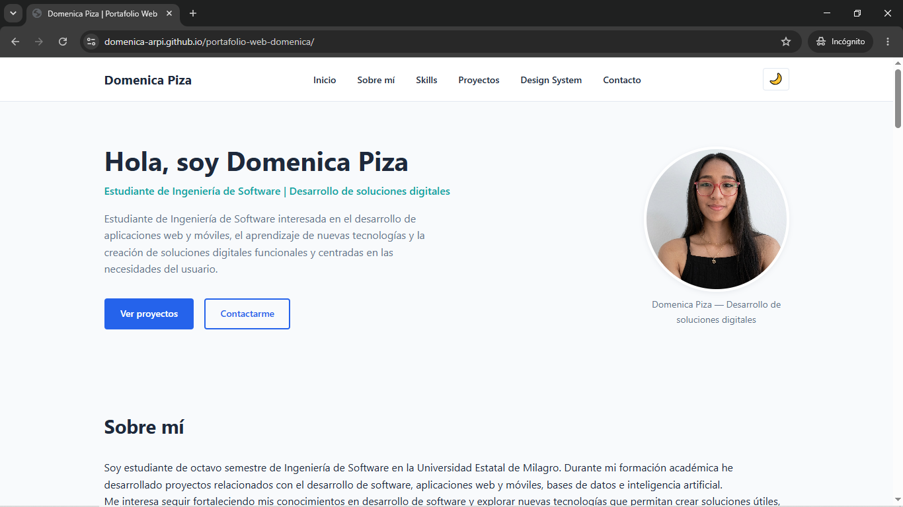
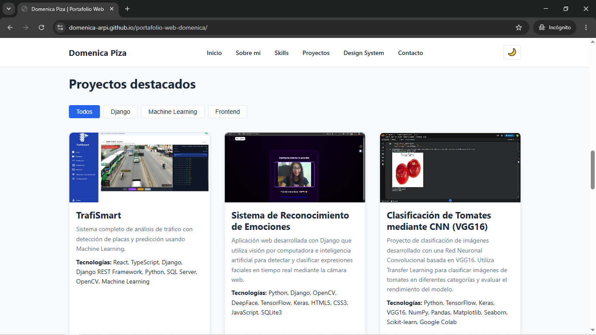
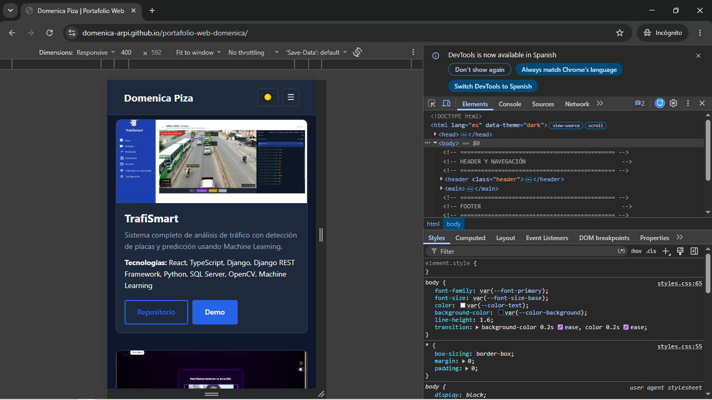

# Portafolio Web

## Descripción

Portafolio web personal e interactivo desarrollado con HTML5, CSS3 y JavaScript
vanilla, que comunica información académica y profesional, proyectos destacados
y habilidades técnicas. Proyecto académico en desarrollo.

## Tecnologías utilizadas

* HTML5
* CSS3
* JavaScript (vanilla)

## Características

* Estructura de página única (single page) con navegación interna.
* Secciones: Inicio, Sobre mí, Skills, Proyectos, Design System, Contacto.
* Diseño responsive (computadora, tablet, móvil).
* Sistema de diseño documentado (colores, tipografía, espaciado, componentes).
* _(Las funcionalidades interactivas se documentarán al finalizar el Commit 3)._

## Estructura del proyecto

```
portfolio/
│
├── index.html          # Estructura principal del sitio
├── README.md            # Este archivo
├── css/
│   └── styles.css       # Estilos y CSS Custom Properties
├── js/
│   └── script.js        # Lógica interactiva (menú, tema, filtros, validación)
└── assets/
    ├── img/              # Imágenes de perfil y proyectos
    └── icons/            # Íconos utilizados en el sitio
```

## Visualización local

1. Clonar o descargar este repositorio.
2. Abrir el archivo `index.html` directamente en el navegador.

No requiere instalación de dependencias ni servidor backend.

## GitHub Pages


URL pública: https://domenica-arpi.github.io/portafolio-web-domenica/

## Capturas



.